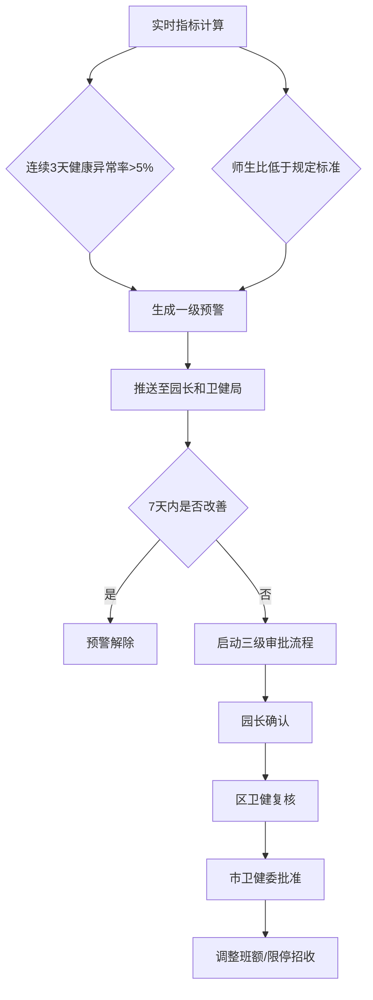
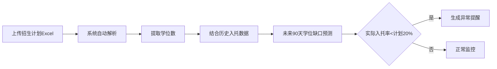

## 1. 产品概述

全国性幼儿园托育服务运营与儿童健康监测分析平台，实现托育机构多源数据实时接入、智能分析与预警决策，助力各级卫健部门和托育机构精细化管理。

- **核心价值**：打通全国托育服务数据孤岛，实现运营状态实时监控、健康风险智能预警、资源配置科学决策
- **目标用户**：国家/省/市卫健部门管理者、托育机构园长、数据分析师

## 2. 核心功能

### 2.1 用户角色

| 角色 | 注册方式 | 核心权限 |
|------|----------|----------|
| 国家级管理员 | 系统分配 | 查看全国数据、全国报表、跨区域对比分析 |
| 省级管理员 | 系统分配 | 查看本省数据、本省报表、省内机构管理 |
| 市级管理员 | 系统分配 | 查看本市数据、本市报表、预警处理、审批流程 |
| 托育机构园长 | 系统分配 | 本机构数据、预警处理、招生计划上传、审批确认 |

### 2.2 功能模块

1. **核心看板**：全国入托热力图、健康合格率排名、关键指标概览、区域切换筛选
2. **实时监测**：多源数据流接入、数据自动清洗、实时指标计算、异常数据标记
3. **预警系统**：健康异常率预警、师生比预警、分级推送、预警状态追踪
4. **审批流程**：三级审批（园长确认→区卫健复核→市卫健委批准）、班额调整、限停招收
5. **机构详情**：近7天出勤趋势、常见疾病分布、餐食剩余率、机构画像
6. **招生预测**：Excel招生计划上传、学位数自动提取、90天学位缺口预测、入托率异常提醒
7. **运营报告**：每周自动生成诊断报告、同比环比分析、优化建议推荐
8. **权限管理**：三级数据权限控制、操作日志审计

### 2.3 页面详情

| 页面名称 | 模块名称 | 功能描述 |
|----------|----------|----------|
| 登录页 | 身份认证 | 账号密码登录、角色权限识别、单点登录支持 |
| 全国总览看板 | 指标概览 | 全国入托率、健康异常率、营养达标率、师生比核心指标卡片 |
| 全国总览看板 | 热力图 | 全国各省份入托率热力分布图，支持省份下钻 |
| 全国总览看板 | 排名榜单 | 健康合格率、师生比省份/城市排名，支持排序切换 |
| 全国总览看板 | 预警概览 | 各等级预警数量统计、待处理预警快速入口 |
| 城市详情页 | 出勤趋势 | 近7天各机构出勤趋势曲线对比、趋势预测线 |
| 城市详情页 | 疾病分布 | 常见疾病类型分布饼图、周同比变化 |
| 城市详情页 | 餐食分析 | 餐食剩余率柱状图、营养达标率分析 |
| 城市详情页 | 机构列表 | 辖区内机构列表、关键指标、异常标记 |
| 机构详情页 | 实时数据 | 当日出勤、体温、饮食、睡眠、活动量实时数据面板 |
| 机构详情页 | 历史趋势 | 近30天各项指标趋势图、同比环比分析 |
| 预警中心 | 预警列表 | 按等级、状态、时间筛选的预警清单、批量处理 |
| 预警中心 | 预警详情 | 预警触发原因、历史数据、关联机构信息、处理记录 |
| 审批中心 | 待办审批 | 三级审批待办列表、审批进度追踪 |
| 审批中心 | 审批操作 | 审批意见填写、附件上传、通过/驳回操作 |
| 招生管理 | 计划上传 | Excel模板下载、批量上传、数据校验、学位数提取 |
| 招生管理 | 学位预测 | 未来90天学位缺口预测表、供需平衡分析图 |
| 报告中心 | 报告列表 | 按周/月生成的运营诊断报告列表、报告下载 |
| 报告中心 | 报告详情 | 完整报告内容展示、图表交互、优化建议 |
| 系统设置 | 权限管理 | 用户管理、角色分配、数据范围配置 |
| 系统设置 | 预警参数 | 预警阈值配置、推送方式配置、审批流程配置 |

## 3. 核心流程

### 3.1 数据接入与处理流程

### 3.2 预警触发与处理流程

### 3.3 招生计划与预测流程

## 4. 用户界面设计

### 4.1 设计风格

- **设计理念**：专业、严谨、数据驱动，体现政务管理系统的权威性与科技感
- **主色调**：深海蓝 `#1a365d`（专业、信赖），搭配医疗绿 `#38a169`（健康、安全）
- **辅助色**：预警红 `#e53e3e`（紧急）、提醒橙 `#dd6b20`（注意）、正常绿 `#38a169`
- **字体**：标题使用 "Noto Sans SC" 粗体，正文使用 "Noto Sans SC" 常规体，数字使用 "JetBrains Mono" 等宽字体
- **布局风格**：卡片式布局，顶部导航 + 左侧菜单 + 主内容区，数据可视化区域占比60%以上
- **图标风格**：线性图标 + 实心图标结合，统一使用24px网格，颜色与语义匹配

### 4.2 页面设计概述

| 页面名称 | 模块名称 | UI元素 |
|----------|----------|--------|
| 全国总览看板 | 指标概览 | 大数字卡片 + 微型趋势图，悬浮显示详情，渐变色背景区分指标类型 |
| 全国总览看板 | 热力图 | 交互式中国地图，省份颜色深浅对应入托率，点击下钻到城市 |
| 全国总览看板 | 排名榜单 | 带进度条的排名列表，支持切换指标类型，前3名特殊标记 |
| 城市详情页 | 出勤趋势 | 多折线对比图，支持机构筛选，悬浮显示具体数值，动画加载 |
| 城市详情页 | 疾病分布 | 环形饼图，支持点击查看详情，图例可交互筛选 |
| 预警中心 | 预警列表 | 带状态标签的表格行，紧急预警红色高亮，支持批量操作 |
| 审批中心 | 审批操作 | 时间线展示审批进度，操作按钮固定底部，支持上传附件 |
| 报告中心 | 报告详情 | 分章节可折叠内容，图表可导出，优化建议带优先级标签 |

### 4.3 响应式设计

- **桌面端（1920px+）**：4列布局，侧边栏展开，完整数据展示
- **笔记本（1366-1920px）**：3列布局，侧边栏可折叠
- **平板（768-1366px）**：2列布局，顶部导航简化
- **移动端（<768px）**：单列布局，汉堡菜单，核心指标优先展示

### 4.4 交互与动效

- **页面加载**：骨架屏加载，内容渐入，图表动画渲染
- **数据更新**：实时数据刷新时数字滚动动画，新数据高亮提示
- **预警提示**：紧急预警呼吸灯效果，声音提醒（可关闭）
- **图表交互**：悬浮显示tooltip，点击下钻，支持区域缩放
- **表单交互**：输入框焦点状态动画，错误提示震动效果
- **导航切换**：平滑过渡动画，当前页高亮指示
