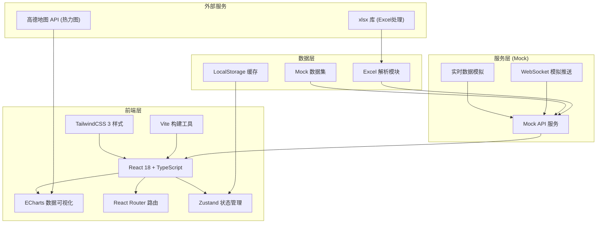
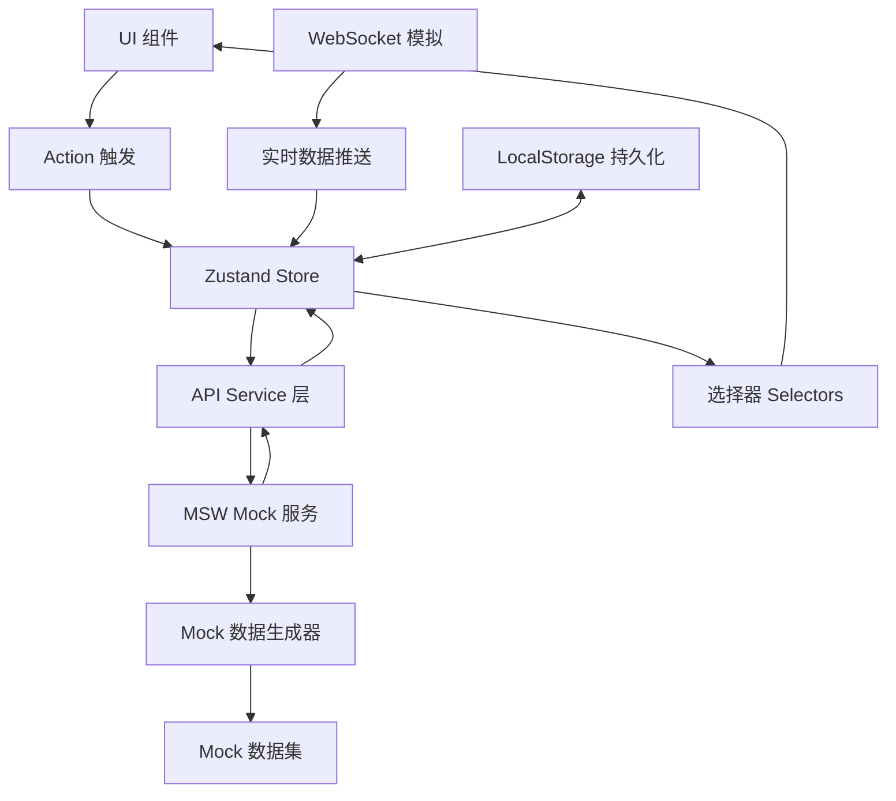
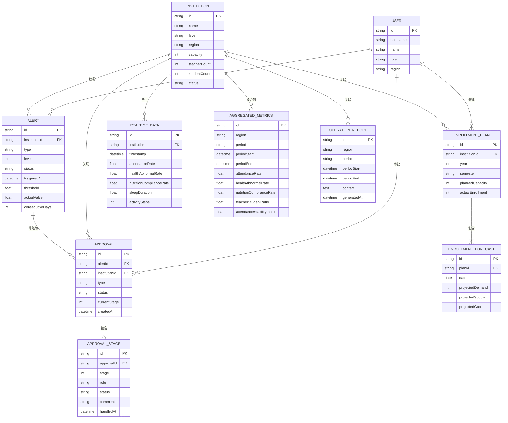

## 1. 架构设计



## 2. 技术描述

- **前端框架**：React@18.2.0 + TypeScript@5.3.0
- **构建工具**：Vite@5.0.0
- **样式方案**：TailwindCSS@3.4.0 + PostCSS
- **状态管理**：Zustand@4.4.0（轻量级，支持持久化）
- **路由管理**：React Router@6.20.0
- **数据可视化**：ECharts@5.4.0 + echarts-for-react
- **地图组件**：高德地图 JS API + 自定义热力图层
- **Excel处理**：xlsx@0.18.0
- **UI组件库**：Ant Design@5.12.0（按需加载）
- **图标库**：@ant-design/icons + lucide-react
- **动画库**：framer-motion@10.16.0
- **Mock方案**：MSW@2.0.0 + 自定义Mock数据生成器
- **代码规范**：ESLint + Prettier + Husky

## 3. 路由定义

| 路由路径 | 页面名称 | 权限要求 | 功能说明 |
|----------|----------|----------|----------|
| `/login` | 登录页 | 公开 | 用户身份认证 |
| `/dashboard` | 全国总览看板 | 已登录 | 全国数据概览、热力图、排名 |
| `/city/:cityId` | 城市详情页 | 已登录 + 对应城市权限 | 城市级数据分析、机构列表 |
| `/institution/:id` | 机构详情页 | 已登录 + 对应机构权限 | 机构实时数据、历史趋势 |
| `/alerts` | 预警中心 | 已登录 | 预警列表、预警处理 |
| `/alerts/:id` | 预警详情页 | 已登录 | 预警详情、处理记录 |
| `/approvals` | 审批中心 | 已登录 + 审批权限 | 待办审批、审批操作 |
| `/approvals/:id` | 审批详情页 | 已登录 + 审批权限 | 审批进度、审批操作 |
| `/enrollment` | 招生管理 | 已登录 | 招生计划上传、学位预测 |
| `/reports` | 报告中心 | 已登录 | 报告列表、报告下载 |
| `/reports/:id` | 报告详情页 | 已登录 | 完整报告内容 |
| `/settings/permissions` | 权限管理 | 管理员 | 用户管理、角色分配 |
| `/settings/alerts` | 预警参数设置 | 管理员 | 预警阈值、推送配置 |
| `/403` | 无权限页 | 公开 | 权限不足提示 |
| `/404` | 页面未找到 | 公开 | 404错误页 |

## 4. API 定义

### 4.1 TypeScript 类型定义

```typescript
// 用户相关
interface User {
  id: string;
  username: string;
  name: string;
  role: 'national' | 'provincial' | 'municipal' | 'principal';
  region: {
    country?: string;
    province?: string;
    city?: string;
    institutionId?: string;
  };
  permissions: string[];
}

// 机构相关
interface Institution {
  id: string;
  name: string;
  level: 'demo' | 'first' | 'second' | 'third';
  address: {
    province: string;
    city: string;
    district: string;
    detail: string;
  };
  capacity: number;
  teacherCount: number;
  studentCount: number;
  establishedDate: string;
  status: 'normal' | 'warning' | 'restricted' | 'closed';
}

// 实时监测数据
interface RealtimeData {
  institutionId: string;
  timestamp: string;
  attendance: {
    total: number;
    present: number;
    absent: number;
    rate: number;
  };
  health: {
    totalChecked: number;
    abnormalCount: number;
    abnormalRate: number;
    abnormalDetails: {
      fever: number;
      cough: number;
      diarrhea: number;
      other: number;
    };
  };
  diet: {
    totalMeals: number;
    remainingRate: number;
    nutritionComplianceRate: number;
  };
  sleep: {
    avgDuration: number;
    complianceRate: number;
  };
  activity: {
    avgSteps: number;
    activityLevel: 'low' | 'medium' | 'high';
  };
}

// 聚合指标
interface AggregatedMetrics {
  regionCode: string;
  regionName: string;
  period: 'day' | 'week' | 'month';
  periodStart: string;
  periodEnd: string;
  attendanceRate: number;
  healthAbnormalRate: number;
  nutritionComplianceRate: number;
  teacherStudentRatio: number;
  attendanceStabilityIndex: number;
  institutionCount: number;
  totalStudents: number;
}

// 预警相关
interface Alert {
  id: string;
  institutionId: string;
  institutionName: string;
  type: 'health_abnormal' | 'teacher_ratio' | 'enrollment_shortfall';
  level: 1 | 2 | 3;
  status: 'pending' | 'processing' | 'resolved' | 'escalated';
  triggeredAt: string;
  threshold: number;
  actualValue: number;
  consecutiveDays: number;
  handler?: string;
  resolvedAt?: string;
  resolution?: string;
}

// 审批相关
interface Approval {
  id: string;
  alertId: string;
  institutionId: string;
  type: 'class_adjustment' | 'enrollment_suspension';
  status: 'pending_principal' | 'pending_district' | 'pending_city' | 'approved' | 'rejected';
  currentStage: number;
  stages: ApprovalStage[];
  createdAt: string;
  proposedAction: string;
}

interface ApprovalStage {
  stage: number;
  role: string;
  status: 'pending' | 'approved' | 'rejected';
  handler?: string;
  comment?: string;
  handledAt?: string;
}

// 招生计划
interface EnrollmentPlan {
  id: string;
  institutionId: string;
  year: number;
  semester: 'spring' | 'autumn';
  plannedCapacity: number;
  actualEnrollment: number;
  enrollmentRate: number;
  forecast: EnrollmentForecast[];
}

interface EnrollmentForecast {
  date: string;
  projectedDemand: number;
  projectedSupply: number;
  projectedGap: number;
}

// 运营报告
interface OperationReport {
  id: string;
  regionCode: string;
  period: 'week' | 'month';
  periodStart: string;
  periodEnd: string;
  metrics: ReportMetrics;
  analysis: ReportAnalysis;
  recommendations: ReportRecommendation[];
  generatedAt: string;
}

interface ReportMetrics {
  attendanceRate: { value: number; yoy: number; mom: number };
  healthAbnormalRate: { value: number; yoy: number; mom: number };
  teacherStudentRatio: { value: number; yoy: number; mom: number };
}

interface ReportAnalysis {
  healthAbnormalReasons: { reason: string; count: number; percentage: number }[];
  teacherRatioRanking: { institutionName: string; ratio: number }[];
}

interface ReportRecommendation {
  priority: 'high' | 'medium' | 'low';
  category: 'class_size' | 'diet' | 'health' | 'staffing';
  content: string;
  expectedImpact: string;
}
```

### 4.2 API 接口定义

```typescript
// 认证接口
POST /api/auth/login
Request: { username: string; password: string }
Response: { token: string; user: User }

POST /api/auth/logout
Response: { success: boolean }

// 机构接口
GET /api/institutions
Query: { region?: string; level?: string; status?: string; page?: number; pageSize?: number }
Response: { list: Institution[]; total: number }

GET /api/institutions/:id
Response: Institution

// 实时数据接口
GET /api/realtime/current
Query: { institutionId?: string; region?: string }
Response: RealtimeData[]

GET /api/realtime/history
Query: { institutionId: string; startDate: string; endDate: string }
Response: RealtimeData[]

// 聚合指标接口
GET /api/metrics/aggregated
Query: { region: string; period: 'day' | 'week' | 'month'; dimension: 'region' | 'institution' | 'age' }
Response: AggregatedMetrics[]

// 热力图数据接口
GET /api/metrics/heatmap
Query: { level: 'province' | 'city'; indicator: 'attendance' | 'health' }
Response: { name: string; value: number; geo: [number, number] }[]

// 预警接口
GET /api/alerts
Query: { status?: string; level?: number; region?: string; page?: number; pageSize?: number }
Response: { list: Alert[]; total: number }

GET /api/alerts/:id
Response: Alert & { institution: Institution; history: Alert[] }

PUT /api/alerts/:id/process
Request: { status: string; resolution: string }
Response: Alert

// 审批接口
GET /api/approvals
Query: { status?: string; region?: string; page?: number; pageSize?: number }
Response: { list: Approval[]; total: number }

GET /api/approvals/:id
Response: Approval & { institution: Institution; alert: Alert }

PUT /api/approvals/:id/approve
Request: { stage: number; comment: string }
Response: Approval

PUT /api/approvals/:id/reject
Request: { stage: number; comment: string }
Response: Approval

// 招生管理接口
POST /api/enrollment/upload
Request: FormData (Excel文件)
Response: { success: boolean; data: EnrollmentPlan[]; errors: string[] }

GET /api/enrollment/plans
Query: { year?: number; institutionId?: string }
Response: EnrollmentPlan[]

GET /api/enrollment/forecast
Query: { institutionId: string; days: number }
Response: EnrollmentForecast[]

// 报告接口
GET /api/reports
Query: { period?: string; region?: string; page?: number; pageSize?: number }
Response: { list: OperationReport[]; total: number }

GET /api/reports/:id
Response: OperationReport

POST /api/reports/:id/download
Response: Blob (PDF文件)

// 系统设置接口
GET /api/settings/users
Response: User[]

POST /api/settings/users
Request: Partial<User>
Response: User

PUT /api/settings/users/:id
Request: Partial<User>
Response: User

GET /api/settings/alert-config
Response: AlertConfig

PUT /api/settings/alert-config
Request: Partial<AlertConfig>
Response: AlertConfig
```

## 5. 前端数据流架构



## 6. 数据模型

### 6.1 ER 图



### 6.2 数据字典

| 表名 | 字段名 | 类型 | 说明 | 默认值 | 约束 |
|------|--------|------|------|--------|------|
| user | id | VARCHAR(36) | 用户ID | - | PK |
| user | username | VARCHAR(50) | 用户名 | - | UNIQUE, NOT NULL |
| user | name | VARCHAR(50) | 姓名 | - | NOT NULL |
| user | role | VARCHAR(20) | 角色 | - | NOT NULL |
| user | password_hash | VARCHAR(255) | 密码哈希 | - | NOT NULL |
| user | region | JSON | 数据范围 | - | NOT NULL |
| user | created_at | DATETIME | 创建时间 | CURRENT_TIMESTAMP | - |
| institution | id | VARCHAR(36) | 机构ID | - | PK |
| institution | name | VARCHAR(100) | 机构名称 | - | NOT NULL |
| institution | level | VARCHAR(20) | 机构等级 | - | NOT NULL |
| institution | province | VARCHAR(50) | 省份 | - | NOT NULL |
| institution | city | VARCHAR(50) | 城市 | - | NOT NULL |
| institution | district | VARCHAR(50) | 区县 | - | NOT NULL |
| institution | capacity | INT | 设计容量 | - | NOT NULL |
| institution | teacher_count | INT | 教师数量 | 0 | NOT NULL |
| institution | student_count | INT | 在园学生数 | 0 | NOT NULL |
| institution | status | VARCHAR(20) | 机构状态 | normal | NOT NULL |
| realtime_data | id | VARCHAR(36) | 数据ID | - | PK |
| realtime_data | institution_id | VARCHAR(36) | 机构ID | - | FK, NOT NULL |
| realtime_data | timestamp | DATETIME | 数据时间 | - | NOT NULL |
| realtime_data | attendance_total | INT | 应出勤人数 | - | NOT NULL |
| realtime_data | attendance_present | INT | 实际出勤 | - | NOT NULL |
| realtime_data | attendance_rate | FLOAT | 出勤率 | - | NOT NULL |
| realtime_data | health_abnormal_count | INT | 健康异常人数 | 0 | NOT NULL |
| realtime_data | health_abnormal_rate | FLOAT | 健康异常率 | 0 | NOT NULL |
| realtime_data | diet_remaining_rate | FLOAT | 餐食剩余率 | 0 | NOT NULL |
| realtime_data | nutrition_compliance_rate | FLOAT | 营养达标率 | 0 | NOT NULL |
| realtime_data | sleep_avg_duration | FLOAT | 平均睡眠时长 | 0 | NOT NULL |
| realtime_data | activity_avg_steps | INT | 平均活动步数 | 0 | NOT NULL |
| alert | id | VARCHAR(36) | 预警ID | - | PK |
| alert | institution_id | VARCHAR(36) | 机构ID | - | FK, NOT NULL |
| alert | type | VARCHAR(30) | 预警类型 | - | NOT NULL |
| alert | level | TINYINT | 预警级别 | 1 | NOT NULL |
| alert | status | VARCHAR(20) | 预警状态 | pending | NOT NULL |
| alert | triggered_at | DATETIME | 触发时间 | CURRENT_TIMESTAMP | NOT NULL |
| alert | threshold | FLOAT | 阈值 | - | NOT NULL |
| alert | actual_value | FLOAT | 实际值 | - | NOT NULL |
| alert | consecutive_days | INT | 连续天数 | 0 | NOT NULL |
| alert | handler_id | VARCHAR(36) | 处理人ID | - | FK |
| alert | resolved_at | DATETIME | 解决时间 | - | - |
| approval | id | VARCHAR(36) | 审批ID | - | PK |
| approval | alert_id | VARCHAR(36) | 关联预警ID | - | FK, NOT NULL |
| approval | institution_id | VARCHAR(36) | 机构ID | - | FK, NOT NULL |
| approval | type | VARCHAR(30) | 审批类型 | - | NOT NULL |
| approval | status | VARCHAR(30) | 审批状态 | pending_principal | NOT NULL |
| approval | current_stage | TINYINT | 当前阶段 | 1 | NOT NULL |
| approval | proposed_action | TEXT | 拟采取措施 | - | NOT NULL |
| approval_stage | id | VARCHAR(36) | 阶段ID | - | PK |
| approval_id | approval_id | VARCHAR(36) | 审批ID | - | FK, NOT NULL |
| approval_stage | stage | TINYINT | 阶段序号 | - | NOT NULL |
| approval_stage | role | VARCHAR(20) | 审批角色 | - | NOT NULL |
| approval_stage | status | VARCHAR(20) | 阶段状态 | pending | NOT NULL |
| approval_stage | handler_id | VARCHAR(36) | 处理人ID | - | FK |
| approval_stage | comment | TEXT | 审批意见 | - | - |
| approval_stage | handled_at | DATETIME | 处理时间 | - | - |
| enrollment_plan | id | VARCHAR(36) | 计划ID | - | PK |
| enrollment_plan | institution_id | VARCHAR(36) | 机构ID | - | FK, NOT NULL |
| enrollment_plan | year | INT | 年份 | - | NOT NULL |
| enrollment_plan | semester | VARCHAR(20) | 学期 | - | NOT NULL |
| enrollment_plan | planned_capacity | INT | 计划学位数 | - | NOT NULL |
| enrollment_plan | actual_enrollment | INT | 实际入托数 | 0 | NOT NULL |
| enrollment_forecast | id | VARCHAR(36) | 预测ID | - | PK |
| enrollment_forecast | plan_id | VARCHAR(36) | 计划ID | - | FK, NOT NULL |
| enrollment_forecast | forecast_date | DATE | 预测日期 | - | NOT NULL |
| enrollment_forecast | projected_demand | INT | 预测需求 | - | NOT NULL |
| enrollment_forecast | projected_supply | INT | 预测供给 | - | NOT NULL |
| operation_report | id | VARCHAR(36) | 报告ID | - | PK |
| operation_report | region | VARCHAR(50) | 区域 | - | NOT NULL |
| operation_report | period | VARCHAR(20) | 报告周期 | week | NOT NULL |
| operation_report | period_start | DATE | 周期开始 | - | NOT NULL |
| operation_report | period_end | DATE | 周期结束 | - | NOT NULL |
| operation_report | content | JSON | 报告内容 | - | NOT NULL |
| operation_report | generated_at | DATETIME | 生成时间 | CURRENT_TIMESTAMP | - |
